# 퇴근

*Toegeun. "Clock Out."*

You are a junior engineer at 성광정보기술 who wakes at 3:17 AM to a building that will not let you leave.
The commute is a dungeon, your manager is a boss fight, and the only exits are a letter of resignation or a coup that puts you in charge.

  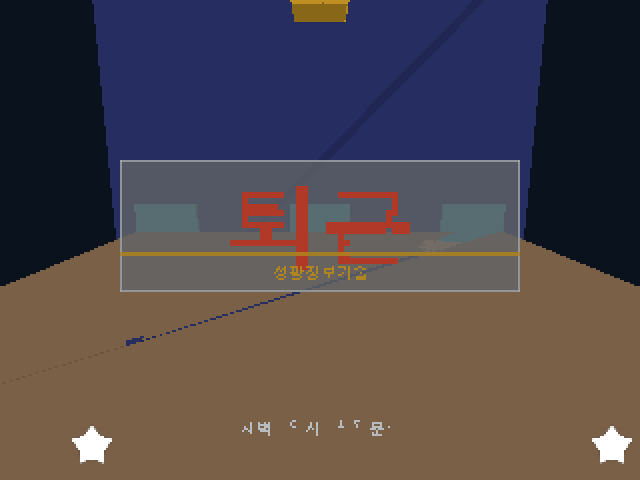

퇴근은 한국식 3D 덱빌딩 오피스 RPG다.
건물은 비뚤어졌고, 출근길은 던전이 되었고, 과장님은 보스전이 된다.
출구는 사직서 하나, 아니면 관리자가 되는 것.

## The loop

The office rearranges itself after hours, as if the floor plan also hates overtime.
Dialogue offers 눈치 choices, but the socially aware line only appears when you have actually read the room.
The scheduler, relationships, and work-life balance push each run toward triumph, burnout, or one more "quick" meeting.

Combat is deterministic.
Cards telegraph intent, status effects resolve in a fixed order, and a thrown chair deals damage through the same impulse solver as the world.
No dice, no excuses.
Even survival ends with paperwork and a deck choice.

## Ten ways the night can go wrong

These are scripted captures from the current 640 by 360 software renderer.
They show real engine state, but the application loop and input-driven screen transitions are still being built.

<table>
  <tr>
    <td align="center">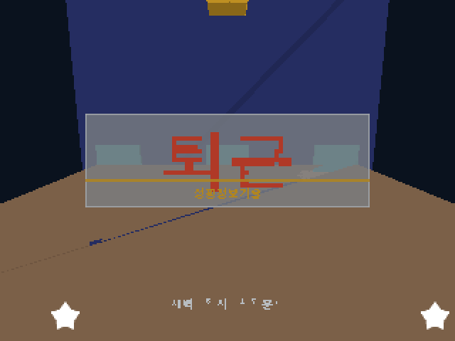 3:17 AM. Obviously.</td>
    <td align="center">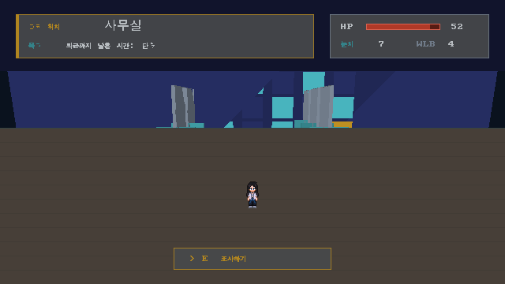 The floor plan has opinions.</td>
  </tr>
  <tr>
    <td align="center">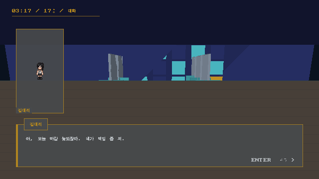 A normal workplace conversation.</td>
    <td align="center">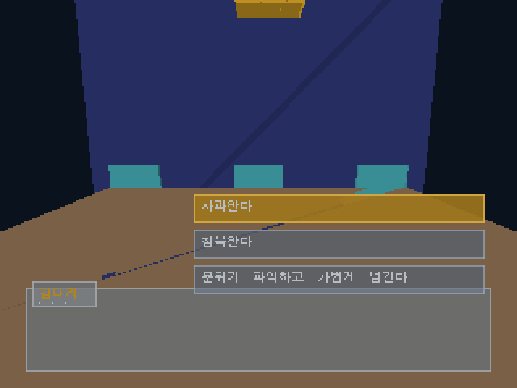 Read the room or suffer.</td>
  </tr>
  <tr>
    <td align="center">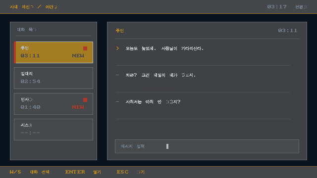 Your inbox found you.</td>
    <td align="center">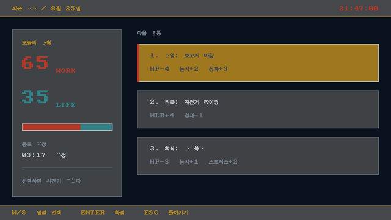 Rest loses another negotiation.</td>
  </tr>
  <tr>
    <td align="center">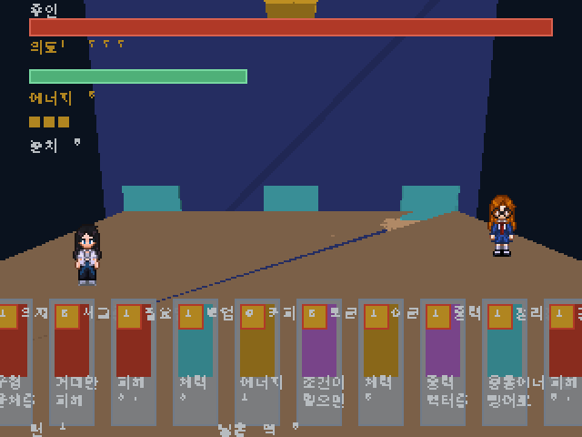 The chair is part of the build.</td>
    <td align="center">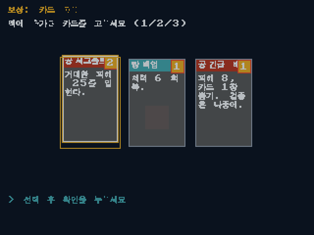 Survival comes with paperwork.</td>
  </tr>
  <tr>
    <td align="center">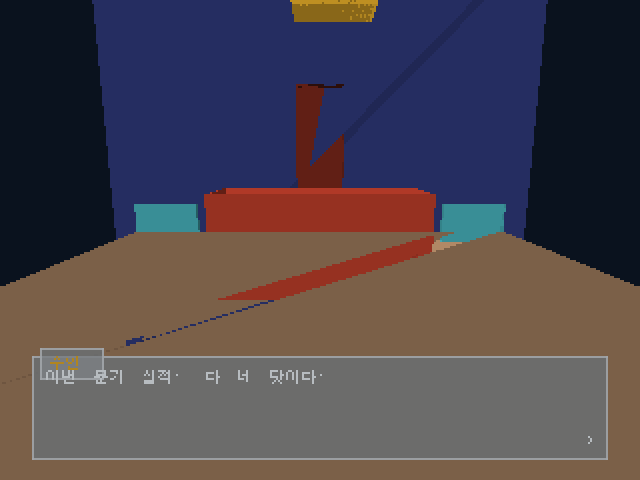 Performance review.</td>
    <td align="center">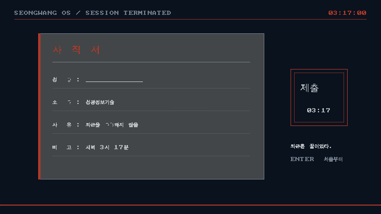 퇴근, one way or another.</td>
  </tr>
</table>

## Under the fluorescent lights

- A hand-written software rasterizer with z-buffering, fog, a 단청-night palette, and a true-color UI layer
- Live Hangul composition from jamo bitmaps and a two-beolsik input method
- Deterministic cards, combat, physics, scheduler, relationships, messenger, and campaign state
- A physics-to-combat event bridge, which is why throwing office furniture is mechanically legitimate

The title, exploration, dialogue, messenger, schedule, reward, and combat screens render today.
The full playable campaign, input loop, and live transitions do not.

[Build it, inspect the mechanics, and read the current scope](GUIDE.md).
