# 퇴근

*Toegeun. "Clock Out."*

You are a junior engineer at 성광정보기술 who wakes at 3:17 AM to a building that will not let you leave.
Your manager is a boss fight.
The copier has already printed your name.

<p align="center">
  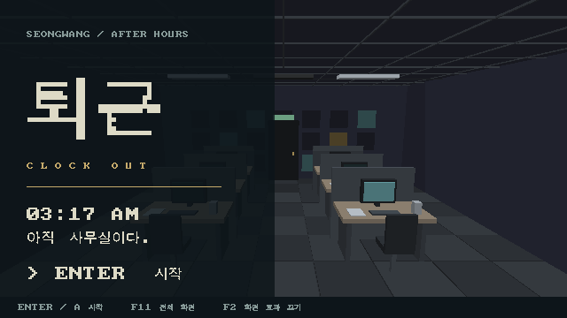
</p>

한국식 3D 덱빌딩 오피스 RPG.
새벽 3시 17분, 아직 사무실이다.

## Play on macOS

With SDL2 installed, run from the repository root:

```sh
make play
```

One playable night: inspect the office, talk to 김대리, stop the copier, choose a card, confront 박과장, and leave.
Reading the attendance record gives you something concrete to say back.
Keyboard and controller input drive the same deterministic combat engine.

The `.HC` sources and hand-written 640×360 renderer stay.
SDL supplies the macOS window, input, and short audio cues; it does not replace the engine.
This is a fixed-camera, hotspot-driven slice, not the full campaign or a TempleOS runtime.

[Controls, setup, tests, scope, and art credits](GUIDE.md).

## A few seconds inside the office

These short reels use the same playable-state captures as the gallery below.
They follow the actual route through the night, with the attendance clue changing the manager fight.

<p align="center">
  
  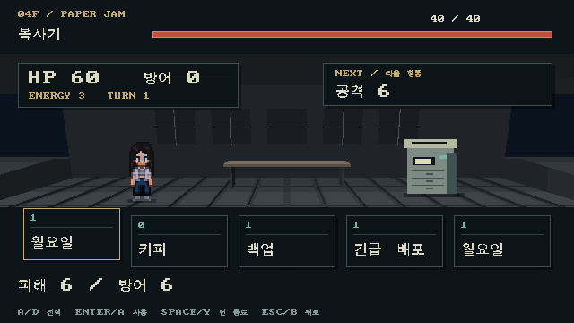
</p>

<p align="center">
  
</p>

## The night, screen by screen

All eleven overhauled screens are shown here, including the title above.
These are native-resolution captures reached through the playable state machine, with real health, cards, and consequences.

<table>
  <tr>
    <td width="50%">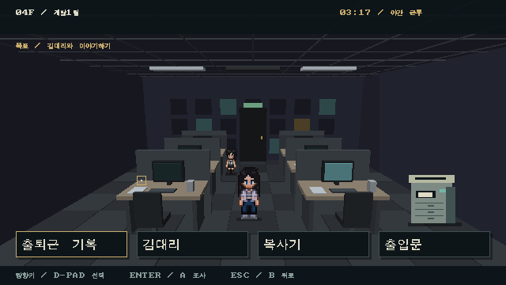<br><sub>01. Four places to look. One way out.</sub></td>
    <td width="50%">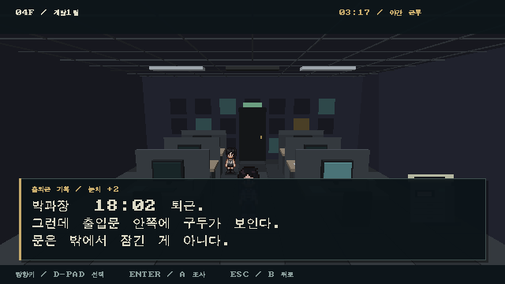<br><sub>02. Someone has already clocked out.</sub></td>
  </tr>
  <tr>
    <td>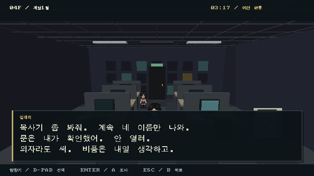<br><sub>03. A normal request from 김대리.</sub></td>
    <td><br><sub>04. The chair is part of the build.</sub></td>
  </tr>
  <tr>
    <td>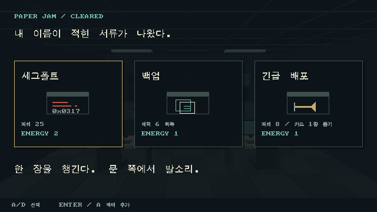<br><sub>05. Survival comes with paperwork.</sub></td>
    <td>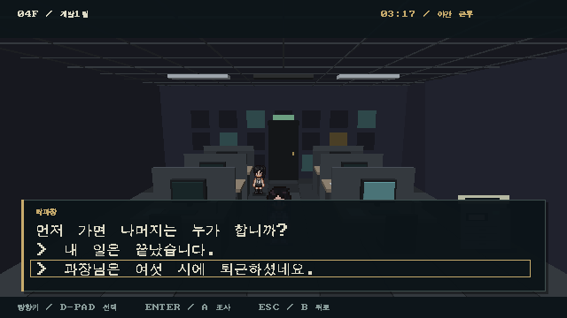<br><sub>06. This time, you kept the receipt.</sub></td>
  </tr>
  <tr>
    <td>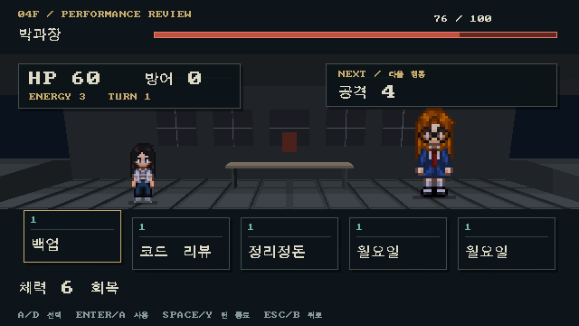<br><sub>07. Performance review.</sub></td>
    <td>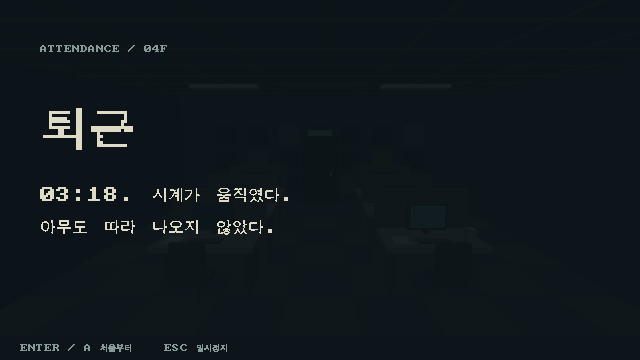<br><sub>08. The clock finally moves.</sub></td>
  </tr>
  <tr>
    <td>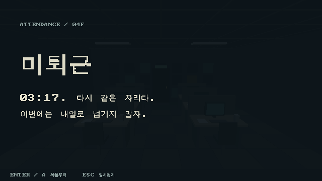<br><sub>09. Same desk. Same time.</sub></td>
    <td>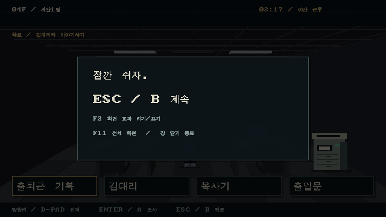<br><sub>10. A break that actually pauses work.</sub></td>
  </tr>
</table>

Rebuild the full gallery and these three GIF reels with `make slice-shots`.
Character art: [LimeZu](https://limezu.itch.io).
